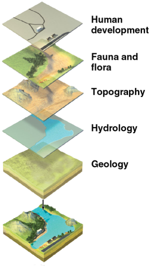
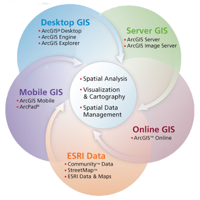

Introduction
============

*"Everything is related to everything else, but near things are more related than distant things."*

---The First Law of Geography by [Waldo Tobler](https://en.wikipedia.org/wiki/Waldo_R._Tobler)

It All Starts With a Map
------------------------
Definitions
:   - *map*---a way of representing any real-world location or object on a two-dimensional surface (for example: on paper or a computer monitor)
    - *feature*---a symbolic representation of the real world (e.g., points, lines and polygons)
    - *absolute location*---a way of describing a position based on a fixed point on Earth (e.g., longitude and latitude)
    - *relative location*---a position defined with respect to other locations

What are maps?

A map is a way of representing any real-world location or object on a two-dimensional surface (for example: on paper or on a computer monitor).

More generally speaking, maps are information and, as we know, information is powerful.
When it comes to information, good information can help improve our lives by empowering us to make better decisions.
As for information, it comes from our understanding of data---in this case, the symbolic representations of the spatial arrangement of our world, which are called *features*.

Maps also serve as a form of communication that can illustrate similarities and differences between places.

Maps help us conceptualize by enabling us to reconstruct our past, illustrate the present, and plan for the future.

Understanding maps allows us to answer important questions, like the "where" (i.e., *absolute* and *relative locations*) and "what" (i.e., properties and attributes) of important features.

What is GIS?
------------
*"Geographic information systems (GIS) are computer-based systems to aid in the collection, maintenance, storage, analysis, output, and distribution of spatial data and information."*--- @bolstad12

{#id .class height=538 width=300}

Because of the importance of spatial information, we have developed tools called geographic information systems (GIS).
We use GIS to gather and use spatial data.

The breadth of GIS encompasses the latest technology of advanced communication networks and software down to the simplest hand-drawn field maps.
Modern technology is changing the way we use GIS and how we gather and use spatial data continues to evolve.

Note that many GIS software packages exist---some quite specialized, others quite broad---and the techniques that will be explored in this course form a common core of GIS that can be applied across various platforms.

GIS Software
------------

### ArcGIS

Concepts
:   - ArcGIS family
    - What can we do with ArcGIS Desktop?
    - ArcGIS applications

{#id .class height=400 width=400}

ArcGIS is developed by Environmental Systems Research Institute, Inc. (referred to as Esri).

ArcGIS Desktop allows you to create, edit and analyze geographic data on your desktop.
This includes the ability to:

- see your data on a map
- analyze your data to reveal patterns, relationships and trends that are not apparent in tabular format
- create publication-quality maps

ArcGIS Desktop applications include:

- *ArcCatalog*: browse geographic data sources and create/update metadata
- *ArcMap*: display and query geographic data on maps and edit/export data
- *ArcToolbox*: access to powerful tools for performing geoprocesses, spatial analysis and data conversions

### ArcMap

Concepts:
:   - Map document
    - Data frame
    - Layer
    - Map scale
    - Pathname
    - Source
    - Thematic mapping

ArcMap uses map documents (.mxd files) to collect spatial data for visualization and analysis.
Map documents do not contain any GIS data; rather, they store the names and locations of sources (i.e., spatial data).
Therefore spatial data can be shared across multiple map documents, but **any change to a data source will affect all map documents that reference it.**

The names and locations of sources are stored as pathnames (i.e., the source's address on your computer).
Pathnames may be stored either as absolute pathnames (i.e., the source address beginning with your computer's driver letter) or relative pathnames (i.e., the source address relative to the folder containing the current map document).
Absolute pathnames are a good way of referencing data sets that are always in the same location for every user.
Relative pathnames are better for referencing data sets that are moved about (e.g., located on a USB drive).

Layers with pathnames that cannot be found (e.g., because the source address has changed), will show with a red exclamation point beside their name in ArcMap's Table of Contents.

Spatial data (e.g., feature class or raster) are added to a map document as layers.
A layer serves as a reference that points to spatial data and includes information for ArcMap on how to display and use these data.

Layers are organized under data frames.
A data frame is a group of layers that are all drawn together.

It is a strength of ArcMap to produce maps, not just of a layer's spatial features, but also to highlight the non-spatial information associated with these features (e.g., attributes).
This technique is called thematic mapping.

Spatial data is visualized in ArcMap at varying map scales, which can be interactively changed by zooming into or out of the map.
The map scale is a measure of the size of features presented in the visualization to their actual size, typically represented as a fraction or ratio.
For example, a typical topographic map by the United States Geological Survey has the scale 1:24,000.
This means that every 1 inch on the map represents 24,000 inches on the ground.

### ArcGIS Pro

The next evolution of ESRI's ArcGIS Desktop software slated to replace ArcMap.
Currently, not all features of ArcMap have been integrated into ArcGIS Pro; therefore, it serves as a supplemental GIS software.

### QGIS

QGIS is an open-source GIS program, which has evolved in recent years to be a
strong competitor to ArcGIS as a personal GIS platform.
QGIS has a decent user interface and it is also possible to script and automate analyses.

One of the strengths of QGIS is that---in addition to providing a GIS interface of its own---it also integrates tools from a range of other GIS programs.
These include:

- The Geospatial Data Abstraction Library ([GDAL](http://www.gdal.org/)), which provides a suite of tools and programs for converting and manipulating spatial data
- The Geographic Resources Analysis Support System ([GRASS GIS](http://grass.osgeo.org/)), which is a complete GIS system in its own right, but has until recently been largely a command-line application.

Spatial Data
============
Concepts:
:   - *Vector Data*---a classification of spatially referenced data, which includes points, lines and areas (polygons)
    - *Raster Data*---a classification of spatially referenced data, which comprise of cell-based surfaces

GIS data files are complicated.
One GIS dataset often consists of multiple linked files that contain different bits of information.
It is common for a particular GIS dataset to have a data file and then separate files used to describe the spatial parts of the data.

Vector Data
-----------
Concepts:
:   - Attributes
    - Feature Class
    - Shapefile

Vector data is the generic term for GIS data built up from defined points in space.
These can simply be points or can be linked into lines and polygons.
These features may also include additional non-spatial information called attributes.

Such data does not really have a resolution because each point identifies a unique point in space.
These points are recorded with a certain precision (e.g., GPS is often &pm;10 meters or so) but this precision may not be known.
Vector data can still be imprecise or inaccurate!

A common file format for storing vector data is the *shapefile*.
A shapefile is actually a collection of at least four files, all of which share the same name, but have different file extensions that relate to the following information.

- **.shp**---The coordinates of the GIS vector features. A shapefile will only contain one type of point, line or polygon data.
- **.shx**---The extent (or limits) of the coordinates. These are used so often, it is convenient to have them stored in a separate file.
- **.prj**---The projection system of the coordinates.
- **.dbf**---A database file containing the attributes of each geographic feature.

A collection of same-type features (point, line or polygon) is called a feature class.

The key point here is that you have to keep all of the different parts of shapefiles together for the data to work.

*Be careful when moving GIS files!*

Raster Data
-----------
Concepts:
:   - *Cell*---a square or rectangular pixel in a raster dataset
    - *Continuous data*---data that do not have well-defined geographic boundaries and when mapped appear to have smooth transitions from one value to another (e.g., temperature, elevation)
    - *Discrete data*---data that have specific values in fixed locations (e.g., buildings, roads, land cover types)
    - *DN*---digital number; the value of a raster cell
    - *Georeferencing*---to define something in physical space (e.g., location, coordinate reference system, map projection)
    - *Pixel*---short for picture element; the smallest element of information in an image

Raster data is the GIS term for gridded data: an equally spaced grid where each cell (or pixel) has one value (digital number or DN) that represents the dominant value of that cell.
These values can be continuous (e.g. elevation or temperature) or discrete (e.g. population densities or habitat categories).
Sometimes raster data may contain null or 'no data' cells.
Examples of raster data include aerial and satellite imagery.

The main advantage of raster data is the ability to portray continuous data that cannot be well represented by points, lines or polygons.

The main disadvantage of raster data is its inaccuracy as compared to vector data.

Raster datasets come in three varieties [@dempsey12]:

- thematic (e.g., Digital Elevation Model)
- spectral (e.g., aerial or satellite imagery used to derive vegetation or geologic information based on spectral signatures)
- picture (e.g., photograph)

A georeferenced raster dataset has several pieces of geographic information:

- the projection of the raster data
- the resolution of the cells (dimension of each cell in the units of the projection)
- a reference point with known coordinates (usually the top left corner of the grid)

Many raster datasets are already georeferenced.
In these cases, when the raster is added to a GIS map, the data will automatically appear in the correct place with reference to the projection.

In other cases, the raster data is not georeferenced---this is often the case with aerial photos, some satellite images or scans of paper maps.
In order to turn such data into a GIS dataset, the data need to be georeferenced.

In georeferencing, a set of ground control points (GCPs) are used to orient the image in space and then this oriented image is resampled into a new dataset with cell boundaries and cell size defined in the projection.

Metadata
========

*"The data about other data."*

---Meriam Webster

Evaluating the quality of data can be difficult, especially if it was created by someone else.
Therefore, there is an obligation to those who create data to include a report that summarizes the data quality (e.g., the spatial accuracy) in addition to information on other aspects of the data (e.g., the creation date or when it was last updated, the geographic area/extent, the coordinate system, explanations of attributes, copyright info and/or use restrictions), in such a way as to inform potential users of the data's limitations and uses such that they can determine whether is best suited for their purpose.
This collection of information about data is called **metadata**. [@price12]

Geographic metadata seeks to answer questions, such as:

* Who developed the data?
* When was the data collected?
* How were the data processed?
* How are the data attributes defined?
* In what formats are the data available?
* How does one obtain the data?

Standards
---------

The Federal Geographic Data Committee (FGDC) and the International Organization for Standardization (ISO) have worked together to develop metadata standards, including:

* Content Standard for Digital Geospatial Metadata (CSDGM)
* ISO 19115

Faced with several standards, preparing a complete set of metadata can be a daunting task; however, it most cases, some information is better than none.
Regardless of the standard, the core components of the metadata record should include (https://www.fgdc.gov/metadata):

Metadata Record Information
:    - information about the metadata record including the language in which the record is written, a unique file identifier for the metadata record, the metadata standard used to organize the record, a point of contact for the metadata record, and the date that the metadata record written

Identification Information
:   - citation-level information about the data including the title, abstract, purpose for creation, status, keywords (theme and place), and extent (temporal, vertical and horizontal)

Constraints Information
:   - information about legal and security limitations to data access and use

Data Quality Information
:   - information about the processes and sources used to develop the data and positional and/or accuracy assessments performed

Maintenance Information
:   - information about the scope and frequency of data updates

Spatial Representation
:   - information about the mechanism used to represent spatial data (grid, point, vector)

Reference System Information
:   - information about the reference systems used to represent geographic position and time

Content Information
:   - information about the data set entities and attributes

Symbology Information
:   - information about the symbols used to represent spatial features

Distribution Information
:   - information about the data distributors and methods for obtaining the data

Metadata Extension Information
:   - information about custom, user-based, changes to the elements, domains or conditionality of the standard

Application Schema Information
:   - information about the schema or data models used to structure the data

Databases
=========
Geographic data (e.g., vector, raster and table) may be collectively stored together in what is called a geodatabase---a versatile format convenient for data editing and management.

These are several types of geodatabases.
The one we are focused on in this class is the *File geodatabase*.

File Geodatabase
:   This database type is designed for individuals or small groups.
    The data set is stored as a separate file within a system folder and each file can be up to one terabyte in size.
    File geodatabases are best for cross-platform operations (i.e., accessible by multiple operating system architectures, such as Windows, Macintosh, and Linux). [@price12]

Database design
---------------
Good databases do not happen by accident [@price12].
Geodatabases are created as empty shells.
These shells have a defined organizational structure (this data model is called a *schema*) into which feature classes and other objects can be added.

One organizational method is to create *feature datasets*.
A feature dataset is a collection of feature classes that are related to one another (e.g., they are categorically similar) and share the same spatial reference.

One advantage of geodatabases is the ability to define a set of rules for data attributes.
This is accomplished through the use of an attribute *domain*---pre-defined attribute value constraints.

There are two types of domains: *range domains* and *coded domains*.

Range domains
:   A specification of the lowest and highest acceptable values.

Coded domains
:   A specification list of acceptable values.
    These values are made of code and textual description pairs.

Coordinate Reference Systems
============================
The origin of geographic coordinates begin with how we define the size and shape of Earth---originally reasoned to be a sphere by Pythagoras (570--495 B.C.) and later by Aristotle (384--322 B.C.), but it was not until Sir Isaac Newton (1643--1727 C.E.) that Earth's shape was reasoned to be an ellipsoid.
Earth's circumference was first calculated within 4% of modern estimates by Eratosthenes (276--194 B.C.).

Geographic Coordinate Systems (GCS)
-----------------------------------
Definitions
:   - *Datum*---a reference from which spatial measurements are made; a set of points (coordinate locations) specifying positions on Earth's surface
    - *Latitude*---angular measurement north or south of the equator; also known as parallels
    - *Longitude*---angular distance measured east or west from a given meridian (e.g., the Prime Meridian located at the Royal Observatory in Greenwich, England); also known as meridians
    - *Origin*---defined by coordinates (0,0)
    - *Point*---described by a single *x*-*y* coordinate pair
    - *Line*---a series of *x*-*y* coordinates

In order to display and analyze maps on screen, a GIS system uses coordinate pairs that specify the location and shape of a particular feature.
The geographic coordinate system (GCS) aids defining where coordinate pairs are located in space, whereby *x*-*y* coordinate pairs are defined in degrees of longitude and latitude.

GIS tools layer geospatial data for a given area; therefore it is important that the coordinate systems of these layers be the same.

In reality, layers are often not in the same coordinate system or resolution; therefore, they must undergo projection or transformation.

Projected Coordinate Systems
----------------------------
Definitions

:   - *Mercator Projection*---cylindrical projection that preserves angles and shapes of small objects, but distorts the size and shape of large objects
        - {#id .class height=250px width=500px}
    - *Transverse Mercator Projection*---the Mercator projection rotated 90 degrees
        - {#id .class height=250px width=500px}
    - *USA Contiguous Albers Equal Area Conic USGS version*---used by the USGS, this coordinate system is good for mapping the continental United States with minimal distortion. It is best for land masses that extend from east to west more than north to south, making it perfectly suitable for the U.S.
        - {#id .class height=250px width=500px}
    - *Universal Transverse Mercator (UTM) Coordinate System*---a standard set of map projections developed by the U.S. Military and widely adopted for coordinate specification over regional study areas. There are 60 six-degree wide UTM zones.
        - {#id .class height=250px width=500px}

Because the earth is not flat, any map is a projection of the surface of the Earth onto a flat surface, whether it is a printed map or GIS data on a screen.

To complicate things, a map projection is actually defined by two components:

1. The *geographic coordinate system*, which describes the position of the points on the surface of the Earth as latitude and longitude.
The geographic coordinates will vary depending on the model used to describe
the surface of the earth.
The model (or datum) consists of a spheroid---the shape of the earth in
terms of radius and flattening---and this can be local or global.
2. The *projected coordinate system*, which are the XY positions of latitude and
longitude points on the flattened surface.

To maximize information from a given map, it is ideal that it preserves the shape, area, distance and direction; however, these properties cannot all be preserved at once.

### Projection Types

There are hundreds of different projections, some of which are defined below.

- Conformal: maintains local angles and shapes
- Equal-area: maintains area
- Equal-distant: maintains distance
- True-direction: maintains directions with respect to a fixed central point
- Universal Transverse Mercator (UTM): maintains both conformal and equal area

### Projection Distortions

The Mercator projection attempts to flatten the spherical surface of Earth, which results in the exaggeration of object sizes as the distance from the equator increases.

{#id .class height=500 width=500}

Due to these limitations, for large-scale maps, equal-area projections are recommended in place of the Mercator projection.

*Geodesic* geometry attempts to account for distance distortions caused by coordinate system projections.
A geodesic line represents the shortest distance between two points across the Earth's surface.
For example, if you wanted to determine the shortest distance between two cities for an airplane's flight path.

{#id .class height=150 width=274}

What this all boils down to is that if you want to work with GIS datasets, then you need to remember that datasets come with a projection.
You must keep track of these projections or your data are not going to be where you think they are.

Geoprocessing
=============

Analysis Tools
:   - *Clip* (Extract)
    - *Spatial Join* (Overlay)

Conversion Tools
:   - *DEM to Raster* (To Raster)
    - *Polygon to Raster* (To Raster)
    - *Raster to Polygon* (From Raster)

Data Management Tools
:   - *Add Field* (Fields)
    - *Add Join* (Joins and Relates)
    - *Calculate Field* (Fields)
    - *Delete Field* (Fields)
    - *Merge* (General)
    - *Project* (Projections and Transformations)
    - *Remove Join* (Joins and Relates)
    - *Select Layer By Attribute* (Layers and Table Views)

Spatial Analyst Tools
:   - *Euclidean Distance* (Distance)
    - *Fill* (Hydrology)
    - *Flow Accumulation* (Hydrology)
    - *Flow Direction* (Hydrology)
    - *Raster Calculator* (Map Algebra)
    - *Reclassify* (Reclass)
    - *Snap Pour Point* (Hydrology)
    - *Watershed* (Hydrology)

Geostatistics
=============

History
-------
As a discipline, geostatistics was firmly established in the 1960s by the French engineer [Georges Matheron](https://en.wikipedia.org/wiki/Georges_Matheron), who was interested in the appraisal of ore reserves in mining.

Geostatistics did not develop overnight.
Like other disciplines, it has built on previous results, many of which were formulated with different objectives in various fields.

Seminal ideas conceptually related to what today we call geostatistics or spatial statistics are found in the work of several pioneers, including:

* 1940s: [Andrey N. Kolmogorov](https://en.wikipedia.org/wiki/Andrey_Kolmogorov) in turbulent flow and [Norbert Wiener](https://en.wikipedia.org/wiki/Norbert_Wiener) in stochastic processing
* 1950s: [Danie G. Krige](https://en.wikipedia.org/wiki/Danie_G._Krige) in mining
* 1960s: B. Mathern in forestry and L.S. Gandin (Russian) in meteorology

Challenge
---------
Most geological phenomena are extraordinarily complex in their interrelationships and vast in their geographical extension.
Ordinarily, engineers and geoscientists are faced with corporate or scientific requirements to properly prepare geological models with measurements involving a significantly small fraction of the entire area or volume of interest.
Exact descriptions of such systems are neither feasible nor economically possible and therefore the results are necessarily uncertain.
It should be noted, however, that **uncertainty is not an intrinsic property of the systems**, rather it is the result of the incomplete knowledge of the observer.[@olea09]

Objectives and Methods
----------------------
The main objective of geostatistics is the characterization of spatial systems that are incompletely known.

Geostatistics makes use of a collection of numerical techniques for the characterization of spatial attributes using primarily two tools:

* probabilistic models
* pattern recognition techniques

The probabilistic models are used as a way to handle uncertainty in results away from sampling locations, making a radical departure from alternative approaches like inverse distance estimation methods.

The Ethics of Information Systems
=================================
All modern information systems enable users to create documents easily and to disseminate those documents widely.
These properties of rapid, inexpensive creation and dissemination usually have good consequences.
For example, during the recovery from Hurricane Katrina in 2005, emergency personnel used geographic information systems to tailor maps and spatial analyses to specific requests.
GIS dramatically decreased the time necessary to create ad hoc maps, and they enabled real-time changes to maps that would not have been possible on paper maps. [@graeff08]

While GIS can promote the good by providing accurate data quickly, GIS can also cause harm through misrepresentations and biases.
Biases are an inherent in all information systems and come about in one of three ways:

preexisting bias
:    - a personal or societal bias that occurs before data are added to a computer system; this can be intentional or unintentional, for example whether or not to include a particular sensitive location.

technical bias
:   - results from limitations on hardware, software, or algorithms; for example, screen size may limit the number of choices that a user sees, thus creating a bias against those options that are hidden or obscured.

emergent bias
:   - arises after an information system is in use; for example, decisions that are made based on old information have a bias when that information changes and the user does not have access to the latest information or the information is not updated in a timely manner.

Applications
============

Natural Disasters and Emergency Management
------------------------------------------
*Emergency management* is the organization and management of resources and responsibilities for dealing with all aspects of emergencies [@nrc07].
The four phases of emergency management include the following:

- preparedness
- response
- recovery
- mitigation

All disasters have a temporal and geographic footprint that identifies the duration of impact and its extent on the Earth's surface.
The term *geospatial* is used to refer to the interdependent resources---imagery, maps, data sets, tools, and procedures---that tie every event, feature, or entity to a location on the Earth's surface and use this information for some purpose.
Although location is an essential part of any item of geospatial data, it is the ability to link a location to the properties of events, features, or entities at that location that gives geospatial data their value.

Throughout this document, three types of geospatial data are discussed:

Framework data

:   - comprise of seven geographic themes that are most commonly produced and used by most organizations in their day-to-day geospatial activities (i.e., [geodetic control](https://www.fgdc.gov/initiatives/framework/handbook/appendixA#geodetic), [orthoimagery](https://www.fgdc.gov/initiatives/framework/handbook/appendixA#orthoimage), [elevation](https://www.fgdc.gov/initiatives/framework/handbook/appendixA#elevation), [transportation](https://www.fgdc.gov/initiatives/framework/handbook/appendixA#transportation), [hydrography](https://www.fgdc.gov/initiatives/framework/handbook/appendixA#hydrography), [governmental units](https://www.fgdc.gov/initiatives/framework/handbook/appendixA#governmental), and [cadastral information](https://www.fgdc.gov/initiatives/framework/handbook/appendixA#cadastral))

Foundation data

:   - support the day-to-day operations of the private or public sector (e.g., maps or data sets of soils, land use, weather, underground pipes, or overhead power lines)

Event-related data

:   - include all those items collected specifically to respond to and recover from a particular disaster event (e.g., the locations of casualties; the locations of response resources; imagery and inventories of property and environmental damage; and earthquake aftershock or chemical plume data)

Watershed Delineation
---------------------

Definitions

:   - Digital Elevation Map (DEM)
    - *Outlet*---any point along a river, stream or creek; defines a unique watershed
    - *Watershed*---an area of land that drains all the streams and rainfall to a common outlet (also known as a drainage basin or catchment)

A watershed is the area of land where all of the water that falls in it and drains off of it goes to a common outlet.
Watersheds are important because the amount and the quality of water of a river are affected by things (e.g., human activity, pollution runoff, heavy rainfall), which are happening in the land area "above" the river-outflow point [@usgs16].

**Delineating a Watershed in GIS**

There are several ways to delineate a watershed; however, using standard GIS tools, the following are the basic steps for delineation.

Required spatial data:

- Elevation (raster) data; elevation or topographic data are required, which may be in the form of a digital elevation map (DEM) or other raster file format
- Outlet location; a watershed is defined by its outlet, which can be any point location along a river, stream or creek---typically, an outlet is defined at a critical juncture (e.g., where two rivers meet) or just upstream of a city or town (e.g., for flood management)

Geoprocessing tools:

- fill sinks
- calculate flow direction
- calculate flow accumulation
- define the pour point
- delineate the watershed

Habitat Suitability Delineation
-------------------------------

Definitions:
:   - *Habitat suitability rank*---identification of potential living areas based on various grades of suitability criteria
    - *Habitat suitability*---identification of optimal living areas based on a set of suitability criteria

Remote Sensing
==============

Definitions

:   - *Atmospheric window*---a region of the EM spectrum that is not blocked by Earth's atmosphere
    - *Photon*---a discrete electromagnetic radiation packet of energy
    - *Pixel*---a picture element; the quantized spatial resolution of a remotely sensed image
    - *Remote sensing*---the collection and interpretation about a target without being in physical contact with it (broad definition); more specifically, it is the non-contact recording of information from the electromagnetic spectrum by means of instruments on platforms (e.g., spacecraft) and the analysis of this information by means of visual and digital image processing

What is remote sensing?

:   - a non-contact method of recording information through the collection (or emission-and-collection) of electromagnetic (EM) radiation
        - data collected from sensors aboard aircraft or spacecraft
    - the art and science of making measurements, which serve as images that can be integrated into GIS
    - specializes in the manipulation, analysis and visualization of images

Remote sensing is useful for measuring:

* *X-Y* geographic locations
* *Z* topographic information
* vegetation health (e.g., chlorophyll content, water content, percent biomass, phytoplankton)
* surface (e.g., sea surface) temperature
* surface roughness
* soil moisture and evaporation
* atmospheric chemistry, temperature, water content, wind speed, precipitation, cloud coverage
* snow and ice coverage
* volcanoes and volcanic activity
* earthquakes
* land use
* ocean health
* etc.

:   Advantages and disadvantages of remote sensing.

+-------------------------------------+---------------------------------------+
| Advantages                          | Disadvantages                         |
+-------------------------------------+---------------------------------------+
| - unobtrusive                       | - not a panacea for everything!       |
| - unbiased data collection          | - human-introduced errors             |
| - non single-point data             | - (active) EM radiation emission      |
|   (large spatial coverage)          | - calibration requirements over time  |
| - in-situ data collection           | - expensive                           |
| - continuous observations from      |                                       |
|   a geostationary altitude          |                                       |
+-------------------------------------+---------------------------------------+

Electromagnetic (EM) spectrum
-----------------------------

Electromagnetic detection
-------------------------

Electromagnetic (EM) waves

:   - vary in wavelength, &nu;, frequency, &lambda;, and energy, E, which are all mathematically interrelated
    - range from gamma (short) to radio (long)
    - travel in discrete packets of energy called *photons*

Wavelengths

:   - *gamma rays*---(&le;0.0001 microns)
        - measure changes in the energy state of protons and neutrons
    - *X-rays*---(&le;0.01 microns)
        - measure photon absorption by the inner shell of electrons
    - *ultra violet (UV)*---(&le;0.4 microns)
        - measure photon emission/absorption by the outer shell of electrons;
        - provide information regarding transition metals (e.g., Fe^2+^, Fe^3+^, Cu^2+^) and chlorophyll
    - *visible light (VIS)*---(&le;0.67 microns)
        - blue (0.450--0.495 microns)
        - green (0.495--0.570 microns)
        - red (0.620--0.720 microns)
    - *near infrared (NIR)*---(&le;1.5 microns)
        - similar to UV
    - *short-wave infrared (SWIR)*---(&le;3.0 microns)
        - measure vibrational structure of certain minerals (e.g., OH^--^, CaCO~3~)
    - *thermal infrared (TIR)*---(&le;100 microns)
        - provide information on molecules and their bond strength;
        - excellent for mineralogy;
        - also provide information on surface temperature (e.g., cloud-top radiation for precipitation estimation)
    - *microwaves*---(0.1 cm--10 m)
        - provide little to no information on composition, but a lot of information about particle size and surface roughness

![Electromagnetic wavelength [@nasa16]](https://www.nasa.gov/sites/default/files/thumbnails/image/ems-introduction.jpeg)

Not all wavelengths in the EM spectrum can reach the surface of the Earth.
Water (H~2~O), carbon dioxide (CO~2~), and ozone (O~3~) are the main atmospheric gases that absorb photons in the visible (VIS) to near infrared (NIR) energy bands.
Regions that are not blocked by the Earth's atmospheric gases and/or dust particles are called *atmospheric windows*.

Even through atmospheric windows, EM energy interacts with gases and particulates before it interacts with the surface.
There are five categories for energy interaction:

1. reflection
    - energy returns from the surface with a reflection angle equal and opposite to the incidence angle
2. scattering
    - deflection in multiple directions
    - *selective (Rayleigh) scattering*
        - caused by particles that are __much smaller__ than the wavelength being scattered (e.g., effects of N~2~, O~2~, and O~3~ on shorter VIS wavelengths cause the sky to look blue)
    - *selective (Mie) scattering*
        - caused by particles that are __about equal__ to the wavelength being scattered (e.g., effects of dust and smoke pollution on longer VIS wavelengths cause red skies)
    - *non-selective scattering*
        - caused by particles that are __much larger__ than the wavelength being scattered (e.g., effects of water vapor and ice crystals on all VIS wavelengths cause clouds and fog to look white)
3. transmission/refraction
    - energy passes through a material
    - may be refracted due to the difference in density between the two materials
4. absorption
    - energy is transformed (e.g., heating)
5. emission
    - energy is released

Remote sensing systems
----------------------

There are two types of [remote sensing systems](https://earthdata.nasa.gov/user-resources/remote-sensors).

* *passive*---detects energy from natural illumination or emission
    * Examples: camera, visible/near infrared instruments, thermal instruments
* *active*---detection of energy reflected back to a sensor after it provides the illumination
    * Examples: camera with flash, flashlight and eye, radar, lasers

Sensing systems are typically onboard an orbiting satellite.
The sensor "views" a portion of the Earth's surface, called the swath.

Image processing and analysis
-----------------------------

Remote sensing measurements are collected as images (i.e., raster format).
Images are a collection of *pixels* (picture elements).
Pixels store recorded values, which are called digital numbers (DNs).
For a typical gray-scale image, DNs are stored as 8-bit integers with values that range from 0--255.

To visualize the images, only a single 8-bit image can be used in each of the three primary colors (i.e., red, green and blue).
__Note: the human eye can only distinguish about 30 shades of gray.__
The mixing of these primary colors produces all other colors.

The comparison of two or more spectral bands can help elucidate information about certain surface processes.
For example, healthy vegetation exhibits a peak in the NIR spectral band, as well as a (albeit much smaller) peak in the VIS green.

![Spectral signatures of soil, vegetation and water. [@siegmund05]](http://www.seos-project.eu/modules/remotesensing/images/Reflexionskurven.jpg)

Resources
=========

Additional Reading
------------------

[Geographic Information Systems, First Edition, 1991](https://www.wiley.com/legacy/wileychi/gis/volumes.html) ---  Copyright &copy; John Wiley & Sons 1991. Converted to HTML by Jim Harper. Last updated January 16, 2001.

[Geometric Aspects of Mapping](http://kartoweb.itc.nl/geometrics/index.html) --- provides information on concepts of spatial referencing, including a brief introduction followed by more in-depth notes on coordinate systems, reference surfaces, map projections and coordinate transformations. International Institute for Geo-Information Science and Earth Observation (ITC), Enschede, 2009.

[GIS as an Integrating Technology](https://www.colorado.edu/geography/gcraft/notes/intro/intro_f.html) --- materials by Kenneth E. Foote and Margaret Lynch, The Geographer's Craft Project, Department of Geography, The University of Colorado at Boulder. Copyright 2000--2015.

[Intro to GIS and Spatial Analysis](https://mgimond.github.io/Spatial/index.html) --- a compilation of lecture notes into an online textbook on data manipulation & visualization and exploratory spatial data analysis by Manuel Gimond

General information
-------------------

[ArcGIS Resources](http://resources.arcgis.com/en/home/)

[ArcGIS Tutorials](https://mgimond.github.io/ArcGIS_tutorials/index.html)

[GeoPlatform Hurricane Response Demo](http://www.mapcontext.com/HurricaneVideo720.mp4) --- format (mp4); length (6:48).

[GIS Certification Institute](https://www.gisci.org) --- a non-profit organization that provides the GIS community with a complete certification program leading to Certified GIS Professional recognition focused on six key knowledge areas: *Conceptual Foundations*, *Cartography and Visualization*, *GIS Design Aspects and Data Modelling*, *GIS Analytical Methods*, *Data Manipulation*, and *Geospatial Data*

[Geo Lounge](https://www.geolounge.com/maps/) --- an information site about all things geography.  Learn about maps and cartography as well as articles covering GIS (geographic information systems), GPS, remote sensing, and other geospatial technologies.

[GIS Lounge](https://www.gislounge.com/) --- news, data and information on GIS

[Living Atlas of the World](https://livingatlas.arcgis.com/) --- the foremost collection of global geographic information from Esri and its partners, including maps, apps, and data layers used to support critical decision making.

[Map Projections](http://geology.isu.edu/wapi/geostac/Field_Exercise/topomaps/map_proj.htm) --- Geospatial Training and Analysis

[The GIS Encyclopedia](http://wiki.gis.com)

Geospatial data
---------------

[ASTER Volcano Archive](https://ava.jpl.nasa.gov/) --- the world's largest specialty archive of volcano data, including publicly available high-resolution multispectral ASTER data.

[FAO GeoNetwork](http://www.fao.org/geonetwork/srv/en/main.home) --- provides interactive maps, satellite imagery and related spatial databases for sustainable development and decision making in agriculture, forestry, fisheries and food security.

[GeoPlatform](https://www.geoplatform.gov/) --- using collaboration, common data, services, applications and shared infrastructure to address national and regional issues and priorities (The Federal Geographic Data Committee).

[Natural Earth](http://www.naturalearthdata.com/) --- a public domain map dataset featuring vector and raster data.

[NCDOT](https://connect.ncdot.gov/resources/gis/Pages/GIS-Data-Layers.aspx) --- North Carolina county and state road system shapefiles.

[NC OneMap GeoPortal](http://data.nconemap.gov/geoportal) --- the geospatial backbone supporting North Carolina data and map service users. It is an organized effort of numerous partners throughout North Carolina, involving local, state, and federal government agencies, the private sector and academia.

[Global Shark Attack File](http://www.sharkattackfile.net/) --- a time-stamped semi-geolocated incident log of global shark attacks.

[USGS TNM](https://viewer.nationalmap.gov/launch/) --- GIS data download and visualization services.

Online tools and software
-------------------------

[ConnectGIS](https://carteret.connectgis.com/Map.aspx) --- an online GIS portal and mapping tool for Carteret County, NC.

[EnviroAtlas](https://www.epa.gov/enviroatlas) --- interactive tools that allow users to discover, analyze, and download data and maps related to ecosystem services, or the benefits people receive from nature

[GeoDa](https://geodacenter.github.io/) --- a free and open source software tool that provides a user-friendly graphical user interface for exploratory spatial data analysis developed by Dr. Luc Anselin and his team. GeoDa runs on Windows, MacOSX and Linux (Ubuntu).

[GeoHack](https://tools.wmflabs.org/geohack/) --- a modified version of map sources from Egil Kvaleberg's gis extension. It is designed to do simple HTML replacements of a template on Wikipedia and serve it to the client. It is used by Wikipedia to provide links to various mapping services, when a user clicks on a link with geographical coordinates. For example, [click here](https://tools.wmflabs.org/geohack/geohack.php?params=35_41_25.8_N_80_28_49_W) to GeoHack the Center for the Environment.

[Google Earth](https://www.google.com/earth/) --- software that renders a 3D representation of Earth based on satellite imagery based on the superimposition of images obtained from satellite imagery, aerial photography, and GIS data onto a 3D globe, allowing users to see cities and landscapes from various angles.

[OpenStreetMap.org](https://www.openstreetmap.org/#map=16/35.6918/-80.4897) --- a collaborative project to create a free editable map of the world.

[ReefBase](http://www.reefbase.org/) ---  A Global Information System for Coral Reefs.

References
==========
